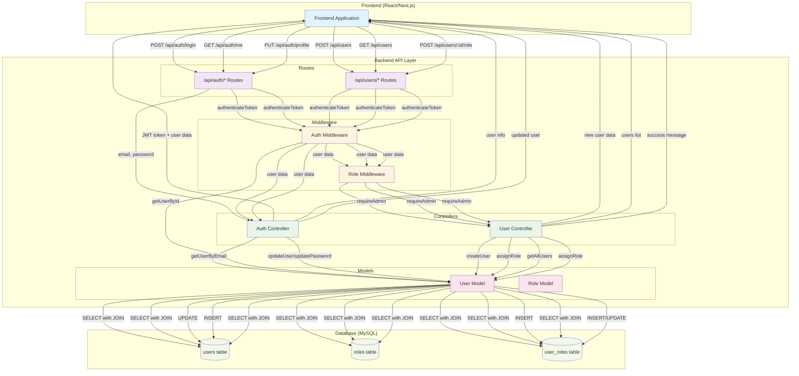

# Data Flow Diagram (DFD): Authentication & User Management

## Architecture Overview
This diagram shows the data flow for authentication and user management endpoints, including the proper flow through controllers and models.

## Key Components Explained

### Frontend Layer
- **Frontend Application**: React/Next.js application that makes API calls

### Backend API Layer
- **Routes**: Express routes that define API endpoints
- **Controllers**: Business logic handlers for authentication and user management
- **Middleware**: JWT authentication and role-based authorization
- **Models**: Database interaction layer with SQL queries

### Database Layer
- **users table**: Stores user information (id, name, email, password, status, etc.)
- **roles table**: Stores available roles (admin, operator, viewer)
- **user_roles table**: Junction table linking users to their roles

## Data Flow Patterns

### Authentication Flow
1. Frontend sends login credentials
2. Route → Auth Controller → User Model → Database
3. Database returns user data with roles
4. Auth Controller generates JWT token
5. Frontend receives token and user data

### Protected Endpoint Flow
1. Frontend sends request with JWT token
2. Route → Auth Middleware (validates token)
3. Role Middleware (checks permissions)
4. Controller → Model → Database
5. Database returns data
6. Frontend receives response

### User Management Flow (Admin Only)
1. Frontend sends admin request with JWT token
2. Route → Auth Middleware → Role Middleware (admin check)
3. User Controller → User Model → Database
4. Database performs CRUD operations
5. Frontend receives response 