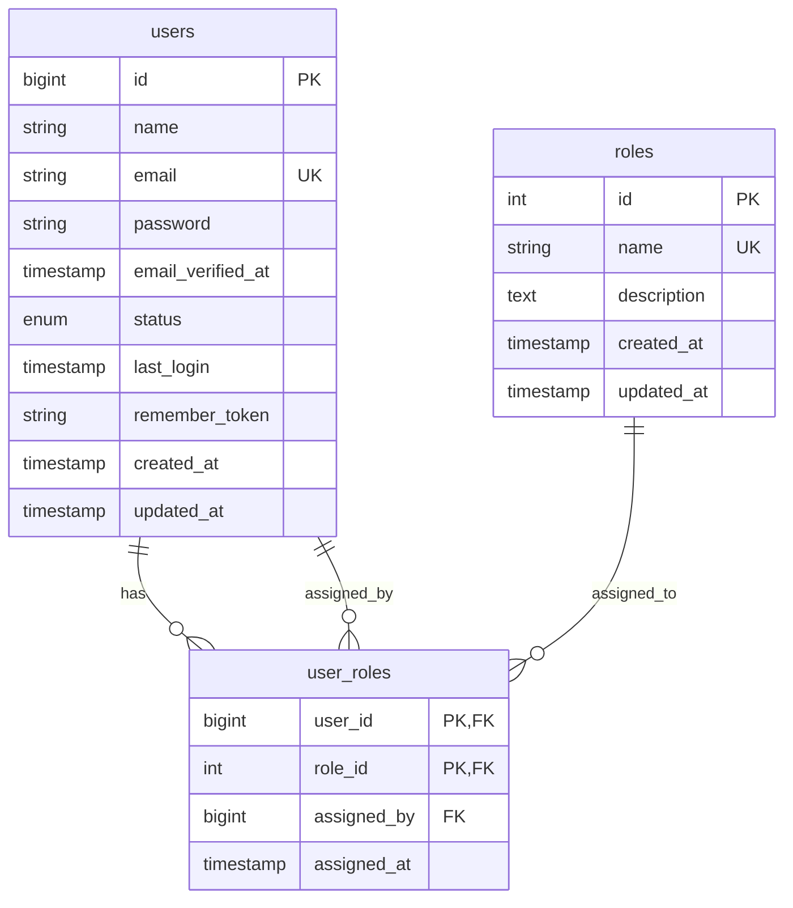

# Entity Relationship Diagram (ERD): Authentication & User Management

## Database Schema Overview
This diagram shows the relationships between users, roles, and user_roles tables in the authentication system.

## Table Relationships

### users → user_roles (One-to-Many)
- One user can have multiple roles
- Primary key: `users.id` → Foreign key: `user_roles.user_id`

### roles → user_roles (One-to-Many)
- One role can be assigned to multiple users
- Primary key: `roles.id` → Foreign key: `user_roles.role_id`

### users → user_roles (One-to-Many) - Assignment Tracking
- One user can assign roles to multiple other users
- Primary key: `users.id` → Foreign key: `user_roles.assigned_by`

## Key Features

### Users Table
- **id**: Auto-incrementing primary key
- **email**: Unique constraint for login
- **password**: Bcrypt hashed
- **status**: 'active' or 'inactive'
- **last_login**: Tracks user activity

### Roles Table
- **name**: Unique role names (admin, operator, viewer)
- **description**: Human-readable role descriptions

### User_Roles Table
- **Composite Primary Key**: (user_id, role_id)
- **assigned_by**: Tracks who assigned the role
- **assigned_at**: Timestamp of role assignment 