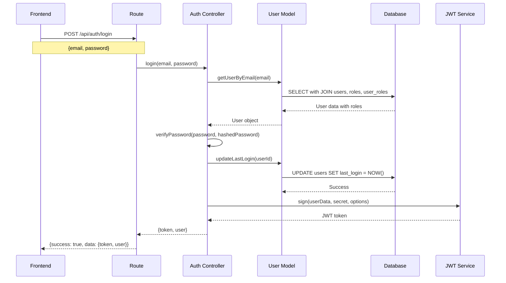
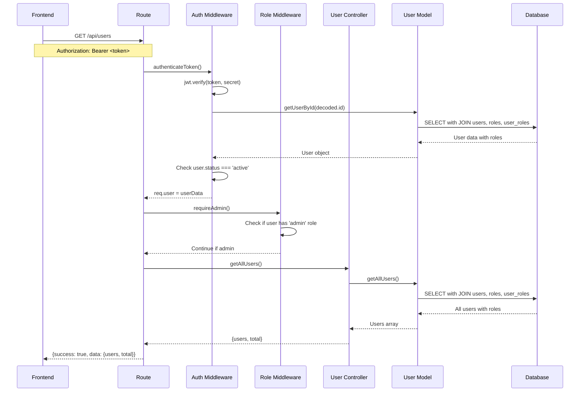
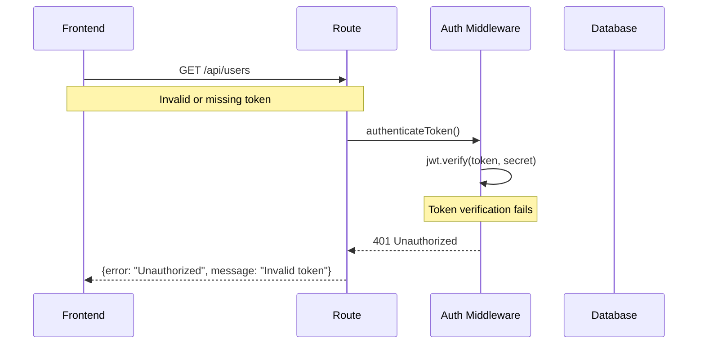

# Sequence Diagram: Authentication Flow

## Login Flow Sequence
This diagram shows the detailed sequence of interactions during user login.

## Protected Endpoint Flow Sequence
This diagram shows the sequence for accessing a protected endpoint (e.g., GET /api/users).

## Error Flow Sequence
This diagram shows what happens when authentication fails.

## Key Benefits of Sequence Diagrams

### 1. **Debugging Efficiency**
- **Pinpoint Issues**: See exactly where failures occur
- **Timing Analysis**: Understand performance bottlenecks
- **Error Tracing**: Follow error paths step-by-step

### 2. **Development Planning**
- **API Design**: Validate endpoint design before implementation
- **Dependency Mapping**: Identify all components involved
- **Testing Strategy**: Plan comprehensive test coverage

### 3. **Team Alignment**
- **Frontend-Backend Coordination**: Both teams understand the flow
- **Database Optimization**: Identify query patterns
- **Security Review**: Verify authentication/authorization steps 